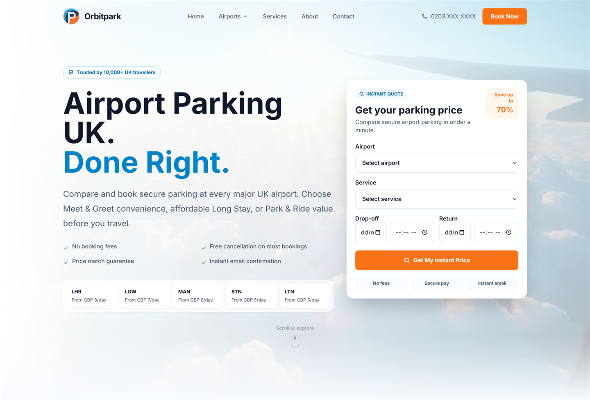
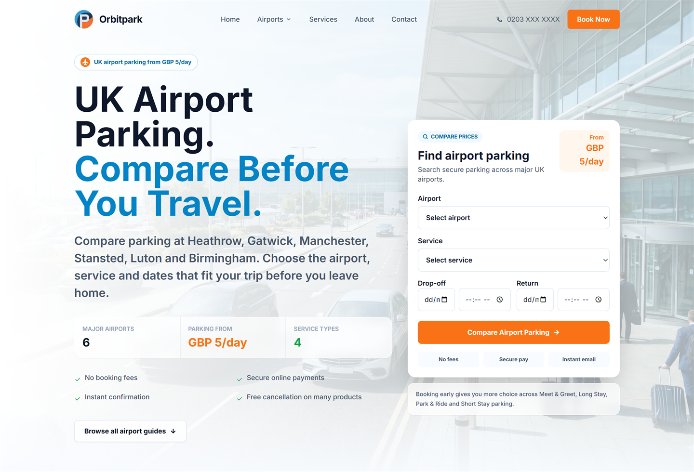
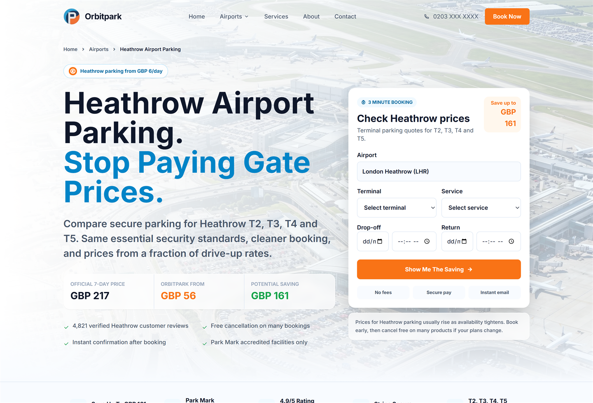
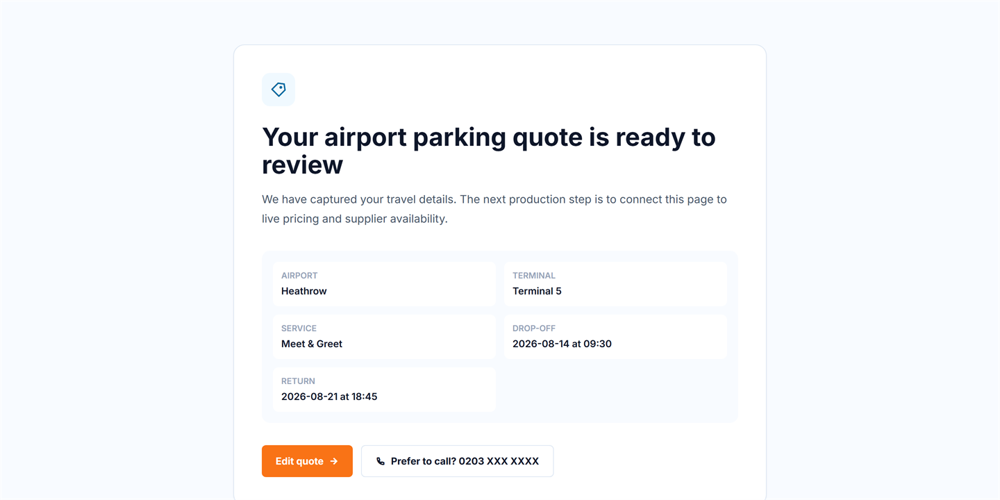

# 🅾 Orbitpark

> **Around Every UK Airport**

Orbitpark is the marketing and quote-capture front end for a UK airport parking
comparison service, built with Next.js 16 and the App Router. It covers the
public-facing journey — landing page, airport hub, airport detail page and quote
capture — for Heathrow, Gatwick, Manchester, Stansted, Luton and Birmingham.

> **Project status — front end only.**
> Every page renders from static mock data in [`src/mocks/`](src/mocks/). There is
> no database, no payment processing and no email delivery yet. The quote form
> collects travel details and passes them to `/quote` as URL parameters, where
> they are echoed back for review. See [Roadmap](#-roadmap) for what is planned
> next.

---

## 📸 Screenshots

### Homepage — hero and instant quote form



### Airports hub — compare across all covered airports



### Heathrow airport page — price comparison and terminal guide



### Quote review — captured travel details



---

## ✈️ Features

- 🔍 Instant quote form on the homepage, airports hub and Heathrow page
- 🛬 Airport hub with cards for six UK airports, each with terminals and services
- 🅿️ Dedicated Heathrow landing page with price comparison, terminal guide,
  traveller personas, directions, tips and reviews
- 📊 Price comparison against official on-airport gate rates
- ❓ FAQ and "how it works" sections
- ⭐ Review carousel and trust strips
- 📱 Mobile-first responsive layout with a sticky mobile call-to-action
- 📞 Click-to-call phone links throughout

## 🛠️ Tech Stack

| Layer      | Technology                    |
|------------|-------------------------------|
| Framework  | Next.js 16 (App Router, Turbopack) |
| Language   | TypeScript 5                  |
| UI         | React 19                      |
| Styling    | Tailwind CSS 3                |
| Components | shadcn/ui (Radix primitives)  |
| Icons      | Remix Icon + Lucide React     |
| Fonts      | Inter via `next/font`         |
| Linting    | ESLint 9 (`eslint-config-next`) |

## 📁 Project Structure

```
src/
├── app/
│   ├── layout.tsx                      # Root layout, Inter font, metadata
│   ├── page.tsx                        # Homepage
│   ├── loading.tsx                     # Route-level loading UI
│   ├── globals.css                     # Tailwind layers + design tokens
│   ├── airports/page.tsx               # Airports hub
│   ├── heathrow-airport-parking/page.tsx  # Heathrow landing page
│   └── quote/page.tsx                  # Quote review (reads searchParams)
├── components/
│   ├── Navbar.tsx
│   ├── TrustBar.tsx
│   ├── MobileStickyCTA.tsx
│   ├── hero/                           # HeroSection, HowItWorks
│   ├── home/                           # Services, airports, reviews, FAQ, CTA, footer
│   ├── airports/                       # Hub hero, cards, service comparison, guides
│   ├── heathrow/                       # Hero, quote form, price comparison,
│   │                                   #   terminal guide, personas, tips, reviews
│   └── ui/button.tsx                   # shadcn/ui button
├── lib/
│   └── utils.ts                        # `cn()` class merge helper
└── mocks/
    ├── homepage.ts                     # Homepage copy and data
    ├── airports.ts                     # Airport hub cards and comparison data
    └── heathrow.ts                     # Heathrow page content
```

## 🚀 Getting Started

### Prerequisites

- Node.js 18.18+ (Next.js 16 requirement)
- npm

### Installation

```bash
# Clone the repository
git clone https://github.com/arslanrk/orbitpark.git

# Navigate to project
cd orbitpark

# Install dependencies
npm install
```

No environment variables are required — the app runs entirely on local mock data.

### Run Development Server

```bash
npm run dev
```

Open [http://localhost:3000](http://localhost:3000).

### Other Scripts

```bash
npm run build   # Production build
npm run start   # Serve the production build
npm run lint    # ESLint
```

## 🗺️ Routes

| Route                        | Rendering | Description                            |
|------------------------------|-----------|----------------------------------------|
| `/`                          | Static    | Homepage with instant quote form       |
| `/airports`                  | Static    | Airport hub with six airport cards     |
| `/heathrow-airport-parking`  | Static    | Heathrow detail and price comparison   |
| `/quote`                     | Dynamic   | Quote review, reads query parameters   |

The mock data also links to per-airport pages for Gatwick, Manchester, Stansted,
Luton and Birmingham, plus per-service pages for Meet & Greet, Long Stay, Park &
Ride and Short Stay. **Those routes are not built yet** — Heathrow is the
reference implementation the rest will follow.

## 🛫 Covered Airports

| Airport    | Code | Terminals       | From      |
|------------|------|-----------------|-----------|
| Heathrow   | LHR  | T2, T3, T4, T5  | £8/day    |
| Gatwick    | LGW  | North, South    | £7/day    |
| Manchester | MAN  | T1, T2, T3      | £6/day    |
| Stansted   | STN  | Main Terminal   | £5/day    |
| Luton      | LTN  | Main Terminal   | £5/day    |
| Birmingham | BHX  | Main Terminal   | £5/day    |

## 🅿️ Services

| Service      | Description                          |
|--------------|--------------------------------------|
| Meet & Greet | Driver meets you at the terminal     |
| Long Stay    | Off-airport secure compound          |
| Park & Ride  | Self-park with shuttle transfer      |
| Short Stay   | Close proximity terminal parking     |

## 📈 Quote Flow

```
Customer → Quote form (homepage / airports / Heathrow)
        → GET /quote?airport=…&terminal=…&service=…&dates…
        → Quote review page renders the captured details
        → [ planned ] Live pricing, checkout, confirmation email
```

## 🎨 Design Tokens

Defined in [`tailwind.config.ts`](tailwind.config.ts) under the `orbit` palette:

| Token             | Value     | Use                    |
|-------------------|-----------|------------------------|
| `orbit-bg`        | `#F8FBFF` | Page background        |
| `orbit-text`      | `#0F172A` | Primary text           |
| `orbit-text-muted`| `#475569` | Body copy              |
| `orbit-border`    | `#DDE7F3` | Card and input borders |
| `orbit-primary`   | `#0369A1` | Brand blue             |
| `orbit-accent`    | `#F97316` | Call-to-action orange  |
| `orbit-success`   | `#16A34A` | Savings and confirmations |

## 🧭 Roadmap

Planned for the booking half of the product:

- [ ] Per-airport pages for Gatwick, Manchester, Stansted, Luton, Birmingham
- [ ] Per-service landing pages
- [ ] Live pricing and supplier availability behind `/quote`
- [ ] Booking flow with a database (PostgreSQL + Prisma)
- [ ] Payments (Stripe) and confirmation emails (Resend)
- [ ] Manage-booking and admin dashboard
- [ ] Analytics and SEO metadata per route

## 📄 License

Private — All rights reserved © 2026 Orbitpark Ltd
